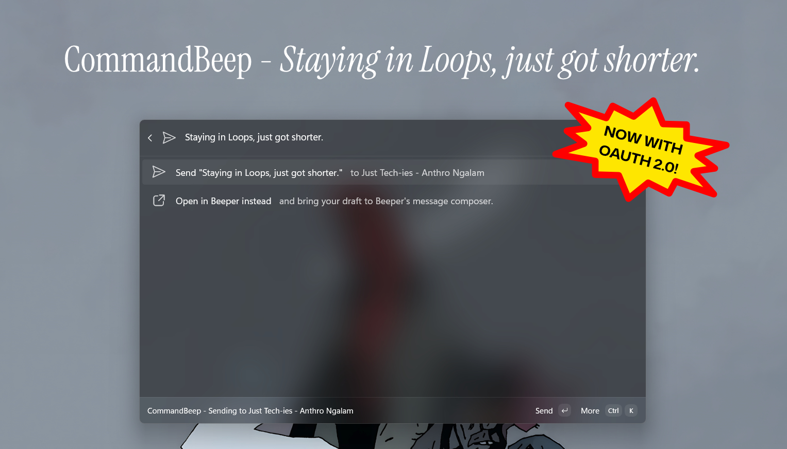
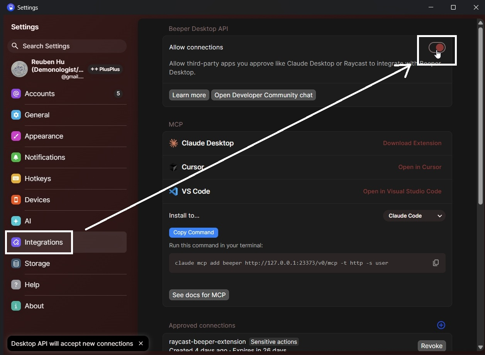
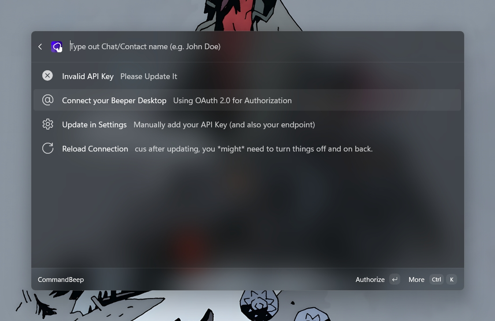

# CommandBeep

Send messages on [Beeper](https://beeper.com) from [PowerToys' Command Palette](https://learn.microsoft.com/en-us/windows/powertoys/command-palette/overview) window directly.

# How It Works?

More information on diagram planning here: [FigJam Link](https://www.figma.com/board/q8LBTIiQcOWvAJ525bE2kS/CommandBeep?node-id=0-1&t=G6Jccg5lCIMLM6ME-1) or [FigJam file attached in this repo.](materials/CommandBeep.jam)

# Guide on Usage

## Enable Beeper Desktop API

Before using CommandBeep (either Production or Development builds from VS), you need to enable Beeper Desktop API function on your Beeper Desktop App.

1. Open Beeper
2. Open Settings, by clicking your photo profile (or `Ctrl + ,`)
3. Go to **Integrations** and **Allow connections**. It should looked like this 

## CommandBeep Time

1. Install the extension:
   - Microsoft Store: https://apps.microsoft.com/detail/9NZD5P5KPLRF
   - Winget: `winget install 9NZD5P5KPLRF`
2. Open PowerToys Command Palette, type `CommandBeep` and press `Enter`.
3. Choose an option **Connect your Beeper Desktop**. Then follow the OAuth 2.0 flow until it's done.

However, if you wanted to use manual API key instead, [follow this instruction instead](use-manual-api-key.md).

# Development

## Pre-requisites

1. [**Visual Studio** with **Windows App SDK** & **WinUI workload** installed](https://learn.microsoft.com/en-us/windows/apps/get-started/start-here?tabs=wingetconfig).[^1]
2. Windows 11 with **PowerToys** installed and **Command Palette** enabled.[^1]
3. [Enable Developer Mode on Windows](https://learn.microsoft.com/en-us/windows/advanced-settings/developer-mode).[^1]
4. **Beeper Desktop** installed with **Desktop API enabled**.[^2]

## Installing Extension

1. Clone the repository (`git clone https://github.com/BenjaminFosters/CommandBeep`).
2. Open the solution file `CommandBeep.sln` in Visual Studio.
3. Build the Solution. **Build > Build Solution** (`F6`).
4. Then deploy the extension. **Build > Deploy Solution**.
5. Open PowerToys Command Palette, type `reload` and reload Command Palette, then it should be (after loading) on the very bottom of the list, or find "CommandBeep".

## Debugging

To debug, use (`F5`) instead and follow the 5th instruction above.

# Feature List

Do keep in mind, I will add necessary features, specifically to prevent [feature creep](https://en.wikipedia.org/wiki/Feature_creep). Also these features are designed for user experience (in terms of intuitiveness and overall performance) and general aesthetics.

## Implemented Features

- [x] Querying Chats
- [x] Sending Message
- [x] User Feedbacks on Actions
- [x] Flow for Opening/Continuing on Beeper Desktop Composer
- [x] Ability to change API key
- [x] Icons for Accessibility & Aesthetics
- [x] OAuth 2.0 authorization support

## Soon to be Implemented

**All Done! 🎊**

## Graveyards (Cancelled Features)

- ~~Photo Profile with circle & 1:1 ratio.~~
- ~~Faster querying speed through caching~~

# My Final Message

I created this extension because I've always wanted and been curious to apply what I've learned, even if it sounds silly. It all started with curiosity, like most engineers and builders early in their careers. This is something I'm truly passionate about and interested in, and I want to share it with the world.

This project isn't going anywhere, but updates will come at my own pace rather than on a fixed schedule, just don't expect anything soon.

My message to future builders and developers is, **Keep building for the world and for yourself.** Thank you.

#OpenToFoster Since 2007 - Reuben Hu/Benjamin Bearington

# Footnotes

[^1]: Source: [Microsoft Learn](https://learn.microsoft.com/en-us/windows/powertoys/command-palette/creating-an-extension#overview)

[^2]: To enable Desktop API, open Beeper Desktop, go to Settings (`Ctrl+,`) > Integrations > Beeper Desktop API > Enable **Allow connections**. It should be available on `http://127.0.0.1:23373`. (**Not to be confused with `localhost` which can have some issues with OAuth 2.0 authorization.**)
