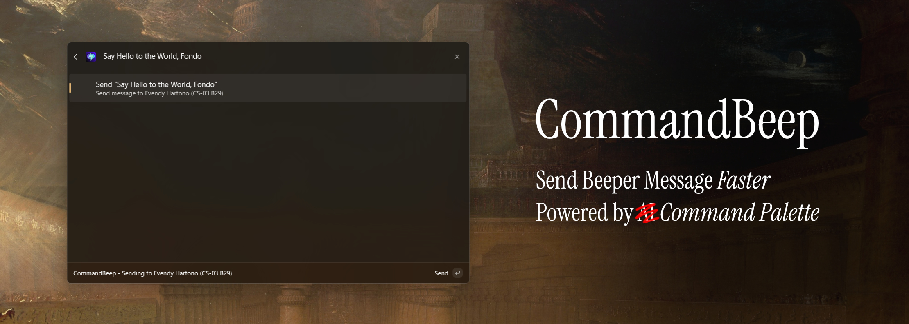
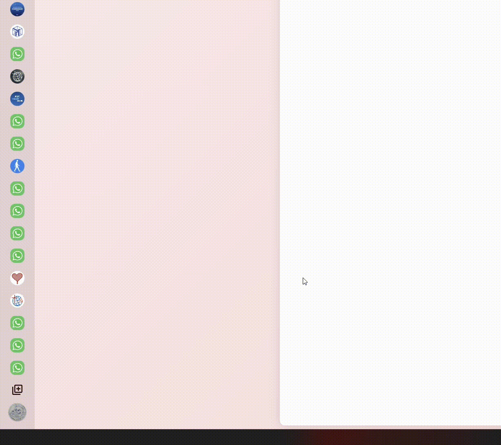
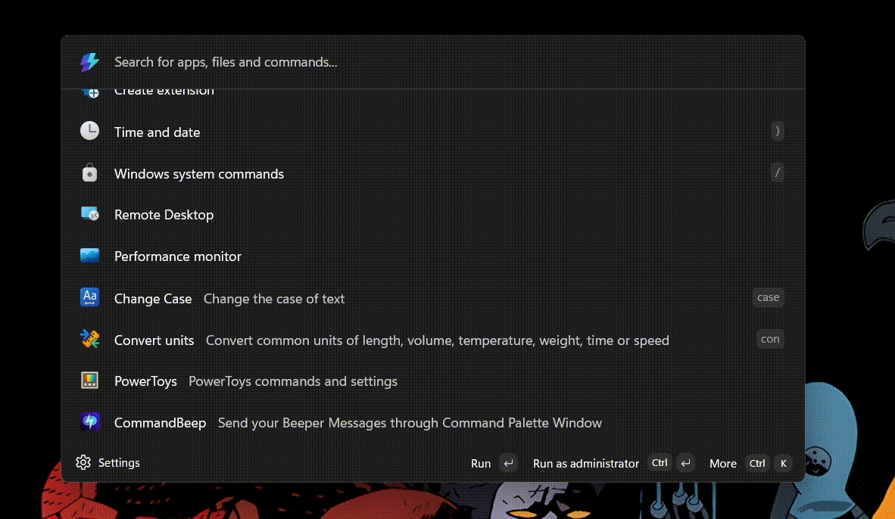

# CommandBeep (Alpha Stage)

Send messages on [Beeper](https://beeper.com) from [PowerToys' Command Palette](https://learn.microsoft.com/en-us/windows/powertoys/command-palette/overview) window directly.

> [!IMPORTANT]
> This is still in proof of concept stage. If you want to try it, there's a guide below.

# How It Works?

More information on diagram planning here: [FigJam Link](https://www.figma.com/board/q8LBTIiQcOWvAJ525bE2kS/CommandBeep?node-id=0-1&t=G6Jccg5lCIMLM6ME-1) or [FigJam file attached in this repo.](materials/CommandBeep.jam)

# Development

## Pre-requisites

1. [**Visual Studio** with **Windows App SDK** & **WinUI workload** installed](https://learn.microsoft.com/en-us/windows/apps/get-started/start-here?tabs=wingetconfig).[^1]
2. Windows 11 with **PowerToys** installed and **Command Palette** enabled.[^1]
3. [Enable Developer Mode on Windows](https://learn.microsoft.com/en-us/windows/advanced-settings/developer-mode).[^1]
4. **Beeper Desktop** installed with **Desktop API enabled**.[^2]

## Installing Extension

1. Clone the repository (`git clone https://github.com/BenjaminFosters/CommandBeep`).
2. Open the solution file `CommandBeep.sln` in Visual Studio.
3. Build the Solution. **Build > Build Solution** (`F6`).
4. Then deploy the extension. **Build > Deploy Solution**.
5. Open PowerToys Command Palette, type `reload` and reload Command Palette, then it should be (after loading) on the very bottom of the list, or find "CommandBeep".
6. Add your Beeper Desktop API key:
   - Go to your Beeper Desktop > Settings (`Ctrl+,`) > Integrations > Beeper Desktop API > Approved Connections > Plus Icon

   | Options                 | Value             |
   | ----------------------- | ----------------- |
   | Name                    | Anything You Want |
   | Expires In              | Never             |
   | Allow sensitive actions | True              |

   Then copy your API key

   
   - Open Command Palette, type `CommandBeep` and press `Ctrl + Enter` to open the settings window, then paste your API key and click **Save**.

   

## Debugging

To debug, use (`F5`) instead and follow the 5th instruction above.

# Feature List

Do keep in mind, I will add necessary features, specifically to prevent [feature creep](https://en.wikipedia.org/wiki/Feature_creep). Also these features are designed for user experience (in terms of intuitiveness and overall performance) and general aesthetics.

## Implemented Features

- [x] Querying Chats
- [x] Sending Message
- [x] User Feedbacks on Actions
- [x] Flow for Opening/Continuing on Beeper Desktop Composer
- [x] Ability to change API key
- [x] Icons for Accessibility & Aesthetics

## Soon to be Implemented

- [ ] OAuth 2.0 authorization support
- [ ] Faster querying speed through caching

## Graveyards (Cancelled Features)

- ~~Photo Profile with circle & 1:1 ratio.~~

# Footnotes

[^1]: Source: [Microsoft Learn](https://learn.microsoft.com/en-us/windows/powertoys/command-palette/creating-an-extension#overview)

[^2]: To enable Desktop API, open Beeper Desktop, go to Settings (`Ctrl+,`) > Integrations > Beeper Desktop API > Enable **Allow connections**. It should be available on `https://127.0.0.1:23373`. (**Not to be confused with `localhost` which can have some issues with OAuth 2.0 authorization.**)
